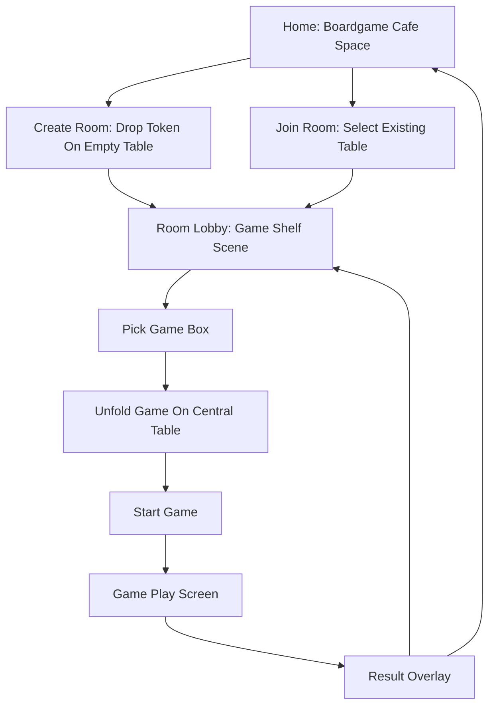

# 인터랙티브 보드게임 카페 리디자인 마스터 플랜

작성일: 2026-07-08  
대상 프로젝트: Board Game Room  
목표: 기존의 정적인 방 목록/게임 선택 UI를 "사용자가 둘러보고, 집고, 놓고, 펼치는" 인터랙티브 보드게임 공간으로 전환한다.

---

## 1. 문제 정의

현재 홈/게임선택 화면은 이전보다 보드게임 테마가 들어갔지만, 사용자가 지적한 핵심 문제는 아직 남아 있다.

- 화면이 "인터랙티브 공간"이 아니라 "인터랙션이 붙은 UI 패널"처럼 보인다.
- 사용자가 돌아보거나 탐색하는 감각이 없다.
- "방을 고르고 바로 앉으세요" 같은 문구가 경험을 설명해 버려서, 공간 자체로 이해되는 느낌이 약하다.
- 플레이어 설정, 방 생성, 게임 선택이 아직 고정된 패널 구조라 AI 생성 사이트처럼 보일 위험이 있다.
- 게임 선택도 상자를 고르는 느낌은 생겼지만, 실제로 선반에서 꺼내 테이블에 펼치는 경험은 더 강해야 한다.

이번 작업의 기준은 다음 문장으로 고정한다.

> 사용자는 보드게임 카페에 들어와 테이블들을 둘러보고, 자기 말을 움직여 테이블에 앉고, 게임 상자를 꺼내 중앙 테이블에 펼친다.

---

## 2. Intent Brief

### 사용자 프로필

- 친구들과 온라인에서 보드게임을 즐기려는 사용자.
- 복잡한 설명보다 화면을 만져 보며 이해하는 것을 선호한다.
- 모바일 접속도 많고, 실제 보드게임 구성물처럼 직관적인 UI를 원한다.
- "AI스럽고 조잡한 카드형 UI"에 피로감이 크다.

### 핵심 과업

1. 방 목록을 확인한다.
2. 비어 있는 테이블에서 방을 만든다.
3. 열린 테이블을 선택해 들어간다.
4. 방 안에서 현재 인원수에 맞는 게임만 고른다.
5. 게임 상자를 테이블에 펼치고 시작한다.

### 감정 톤

- 어둡고 고급스러운 보드게임 카페.
- 목재, 펠트, 박스, 말, 토큰의 질감.
- 설명은 최소화하고, 사물의 배치와 동작으로 이해시킨다.
- 장난감처럼 귀엽기보다는 손맛 있고 세련된 테이블탑 분위기.

### 제약

- 서버 구조는 유지한다. Socket.IO 방/인원/게임선택 API를 그대로 사용한다.
- Northflank 배포 가능한 Node/React 구조를 유지한다.
- 모바일 360px 폭에서도 조작 가능해야 한다.
- 디자인 때문에 가독성을 희생하지 않는다.
- 의미 없는 설명 패널, 방코드 노출, 서버 연결됨 텍스트는 배제한다.
- 게임 실제 플레이 화면은 이번 리디자인과 충돌하지 않아야 한다.

---

## 3. 디자인 방향 제안

### 방향 A: 보드게임 카페 공간형 로비

핵심 이미지:
- 상단에서 내려다본 어두운 보드게임 카페.
- 여러 테이블이 깊이감을 가지고 놓여 있음.
- 사용자가 드래그/스와이프로 카페 공간을 살짝 둘러봄.
- 내 플레이어 말이 입구 또는 하단 도크에 있고, 빈 테이블에 올리면 방 생성.

장점:
- 사용자가 요구한 "막 돌아보면서 뭐할 수 있는" 감각에 가장 가깝다.
- 방 목록이 리스트가 아니라 공간 오브젝트가 된다.
- 게임 사이트 첫 화면으로 개성이 생긴다.

위험:
- 너무 3D처럼 욕심내면 구현 공수와 성능 리스크가 커진다.
- 방이 많을 때 공간 배치가 난잡해질 수 있다.

대응:
- 풀 3D가 아니라 DOM/CSS 기반 2.5D 공간으로 구현한다.
- 방은 최대 노출 개수를 정하고, 나머지는 "뒤쪽 테이블 줄"로 축약한다.
- 모바일은 자유 카메라보다 스와이프 가능한 작은 공간으로 제한한다.

### 방향 B: 보드게임 상점/선반형 인터페이스

핵심 이미지:
- 첫 화면부터 게임 상자와 테이블이 강조된다.
- 방은 작은 테이블 명패로 표시되고, 게임 선택은 선반에서 상자를 꺼내는 방식.

장점:
- 게임 선택 화면과 잘 맞는다.
- 게임 대표 이미지와 박스 아트가 강하게 드러난다.

위험:
- 홈의 방 목록 경험은 여전히 정적인 쇼케이스처럼 보일 수 있다.

대응:
- 홈은 방향 A를 기본으로 하고, 게임 선택 화면에는 방향 B를 부분 적용한다.

### 방향 C: 미니어처 보드게임 월드맵

핵심 이미지:
- 방/게임/플레이어를 미니어처 말과 지형처럼 표현한다.
- 지도처럼 움직이며 방을 고른다.

장점:
- 인터랙션은 강하다.

위험:
- 실제 보드게임 카페보다 게임화된 UI가 되어 성인 사용자에게 유치할 수 있다.
- 기존 게임별 고급 보드 질감과 충돌 가능성이 있다.

판단:
- 이번 프로젝트에는 과하다. 채택하지 않는다.

### 최종 선택

방향 A + 방향 B 조합.

- 홈: 보드게임 카페 공간형 로비.
- 게임 선택: 선반에서 상자를 꺼내 중앙 테이블에 펼치는 인터랙티브 장면.
- 공통: 목재/펠트/박스/말/명패/조명으로 통일한다.

---

## 4. 반드시 피해야 할 기본 패턴

### 피해야 할 패턴 1: 카드 그리드 홈

문제:
- AI 사이트처럼 보인다.
- 방 목록이 데이터 카드로만 느껴진다.

대체:
- 방을 테이블 오브젝트로 표현한다.
- 테이블 위 명패에 `OO의 테이블`, `1/4`, `게임 선택 전`만 표시한다.

### 피해야 할 패턴 2: 큰 설명 헤드라인

문제:
- 사용자가 해야 할 행동을 문장으로 설명한다.
- "바로 앉으세요" 같은 문구가 어색하다.

대체:
- 헤드라인은 작게 유지한다.
- 사물의 상태와 액션으로 이해시킨다.
- 예: 빈 테이블 중앙에 작은 `+` 토큰, 열린 테이블에는 의자/말 표시.

### 피해야 할 패턴 3: 고정된 폼 패널

문제:
- 앱 설정 화면처럼 보인다.
- 보드게임 카페 공간감을 깨뜨린다.

대체:
- 플레이어 설정은 입구 카운터/말 도크로 표현한다.
- 상세 설정은 하단 시트 또는 작은 팝오버로 접는다.

### 피해야 할 패턴 4: 설명용 게임 카드

문제:
- 게임 선택 화면이 설명 문서처럼 보인다.

대체:
- 게임 상자와 미니 보드 프리뷰 중심으로 구성한다.
- 설명은 사용자가 요청할 때만 폴드/팝오버로 열린다.

### 피해야 할 패턴 5: 장식뿐인 모션

문제:
- 움직이긴 하지만 사용자의 행위와 연결되지 않으면 조잡하다.

대체:
- 드래그, 놓기, 선택, 펼치기, 접기, 입장, 생성 같은 행동에만 모션을 준다.

---

## 5. 디자인 시스템 스냅샷

### 핵심 토큰

```text
surface.table-felt: #0b5a42
surface.deep-felt: #062d23
surface.walnut: #3a1f11
surface.dark-room: #070402
surface.parchment: #f2dfad
surface.brass: #d0a047

text.primary: #fff3d2
text.secondary: #dcc28a
text.dark: #241407
text.muted: rgba(255, 239, 200, 0.64)

border.subtle: rgba(238, 199, 124, 0.18)
border.table: rgba(238, 199, 124, 0.36)
focus.ring: #f4c76f
danger: #a83a32
success: #2f9e73
```

### 타이포그래피

- 브랜드/큰 제목: 굵은 라운드 고딕, 하지만 과도하게 크지 않게.
- UI 라벨: 명확한 고딕, 13~15px.
- 숫자/인원/타이머: tabular numeral 적용.
- 방코드는 기본 UI에 표시하지 않는다.

### 간격

- 기본 단위: 8px.
- 모바일 패널 내부: 12px, 16px.
- 데스크톱 공간 오브젝트 간격: 16px, 24px.
- 테이블 오브젝트 최소 터치 영역: 96px x 96px 이상.
- 버튼/칩 터치 영역: 44px 이상.

### 깊이

- 깊이 전략은 "테이블 위 실제 물체" 하나로 통일한다.
- 목재 프레임: 내부 그림자 + 얇은 황동 경계.
- 펠트: 깊은 녹색, 미세 텍스처.
- 박스: 짧은 그림자와 옆면 두께.
- 패널: 완전 카드가 아니라 테이블 주변 소품처럼 처리한다.

### 시그니처 요소

반드시 5개 이상 컴포넌트에 반복 적용한다.

1. 펠트 테이블 표면.
2. 목재 프레임.
3. 황동 명패.
4. 실제 말/토큰 도킹.
5. 게임 상자 열림/접힘.
6. 사물 중심 hover/focus glow.

---

## 6. 전체 화면 구조



---

## 7. 페이지별 상세 작업 지시서

## 7.1 홈: 보드게임 카페 공간형 로비

### 목적

사용자가 방 목록을 리스트가 아니라 카페 안의 테이블들로 인식하게 한다.

### 레이아웃

데스크톱:
- 전체 화면은 어두운 보드게임 카페 배경.
- 중앙에 `CafeFloorScene`.
- 테이블은 원근감 있는 2.5D 배치.
- 우측 고정 설정 패널 금지.
- 플레이어 말/이름 설정은 하단 또는 좌하단 `EntranceCounter`로 축소.

모바일:
- 세로 화면에서 상단은 작은 브랜드 바.
- 그 아래 카페 공간 viewport.
- 사용자는 좌우/상하 스와이프로 테이블들을 살짝 둘러본다.
- 플레이어 설정은 하단 시트로 접힘.

### 핵심 컴포넌트

```text
InteractiveCafeHome
CafeViewport
CafeCameraLayer
CafeTableObject
EmptyTableObject
OccupiedTableObject
PlayingTableObject
PlayerTokenDock
EntranceCounterSheet
RoomTableNameplate
AmbientTableProps
```

### 테이블 상태

빈 테이블:
- 펠트 중앙에 작은 황동 `+` 토큰.
- 의자 4개는 비어 있음.
- 클릭/탭: 방 생성 후보 상태.
- 내 말을 드래그해서 올리면 방 생성.

열린 방:
- 테이블 위에 방장 말 1개.
- 빈 좌석은 작은 의자/점으로 표시.
- 명패: `OO의 테이블`, `1/4`.
- 선택 시 확대/포커스, 상세 액션 시트 표시.

게임 중 방:
- 테이블 위에 닫힌 게임 박스 또는 진행 중 보드 실루엣.
- 어둡게 처리하되 구경 가능 여부가 없다면 클릭 불가.

만석 방:
- 의자가 모두 차 있음.
- 명패는 흐리게.
- 액션 없음.

### 사용자 인터랙션

카메라 이동:
- 데스크톱: 배경 드래그로 시야 이동.
- 마우스 휠: 약한 줌 또는 수평 이동. 과하면 금지.
- 모바일: 손가락 스와이프.
- 키보드: 방향키로 포커스 테이블 이동.

방 생성:
- 내 말을 빈 테이블에 드래그 앤 드롭.
- 또는 빈 테이블 선택 후 하단 액션 시트에서 `테이블 만들기`.
- 생성 중에는 말이 테이블 중앙에 착석하는 짧은 애니메이션.

방 입장:
- 열린 테이블 선택.
- 테이블이 살짝 확대되고 좌석이 강조됨.
- 하단 시트에서 `입장` 실행.
- "바로 앉으세요" 같은 문장 금지.

플레이어 설정:
- 처음에는 말과 이름만 보인다.
- 말 클릭 시 커스터마이징 시트.
- 커스터마이징은 얼굴/색/장식/몸체 선택.
- 설정 패널이 공간을 압도하면 안 된다.

### 금지 문구

- "방을 고르고 바로 앉으세요."
- "실시간 보드게임 테이블"을 큰 제목으로 표시.
- "서버 연결됨".
- "방 코드".

### 허용 문구

- "테이블"
- "빈 테이블"
- "OO의 테이블"
- "게임 선택 전"
- "입장"
- "테이블 만들기"
- "내 말"

### 수용 기준

- 사용자가 첫 화면에서 카드 목록이 아니라 공간을 본다고 느껴야 한다.
- 드래그/스와이프 시 카페 시야가 이동해야 한다.
- 빈 테이블/열린 테이블/게임 중 테이블이 시각적으로 구분되어야 한다.
- 모바일에서 첫 화면이 설정 폼으로 꽉 차면 실패.
- 방이 0개일 때도 공간이 비어 보이되 초라하지 않아야 한다.

---

## 7.2 방 내부 로비: 게임 선반 장면

### 목적

게임 선택을 카드 그리드가 아니라 "선반에서 게임 상자를 꺼내 테이블 위에 펼치는 행위"로 만든다.

### 레이아웃

데스크톱:
- 중앙: 큰 테이블.
- 뒤쪽 또는 하단: 게임 상자 선반.
- 좌측 플레이어 목록은 기존 패널처럼 크게 두지 않는다.
- 플레이어는 테이블 주변 좌석 토큰으로 표시한다.
- 필요할 때만 작은 좌석 리스트 팝오버를 연다.

모바일:
- 중앙 테이블이 상단.
- 게임 상자는 2열 선반.
- 선택 후에는 선반을 접을 수 있어야 한다.
- 시작/타이머는 하단 고정 액션바 또는 접힘 시트.

### 핵심 컴포넌트

```text
InteractiveGameLobby
GameShelfViewport
GameBoxObject
CentralTableStage
UnfoldedBoardPreview
SeatTokensAroundTable
GameActionSheet
TimerSetupSheet
GameInfoFoldout
```

### 게임 상자 상태

```text
shelf: 선반에 놓인 기본 상태
focused: 키보드/hover로 살짝 앞으로 나옴
grabbed: 사용자가 집음
over-table: 테이블 위에 들고 있음
opening: 상자 뚜껑이 열림
unfolded: 미니 게임판이 펼쳐짐
selected: 서버 선택 완료
locked: 현재 인원수에서 선택 불가
```

### 상자 선택 동작

데스크톱:
- hover: 상자가 살짝 앞으로 나옴.
- drag: 상자가 포인터를 따라감.
- table 위 drop: 상자 열림.
- click: drag 없이도 선택 가능.

모바일:
- hover 없음.
- tap: 바로 중앙 테이블에 펼침.
- long press drag는 선택사항. 첫 구현에서는 금지해도 된다.
- 탭 안정성을 위해 모바일에서 상자 transform hover는 끈다.

### 중앙 테이블 동작

선택 전:
- 빈 펠트 테이블.
- "상자를 올려놓는" 시각적 공간.

상자 preview:
- 상자가 테이블 위에 놓임.
- 상자 뚜껑이 열림.
- 미니보드가 펼쳐짐.

게임 변경:
- 기존 보드가 접힘.
- 새 상자가 올라옴.
- 새 보드가 펼쳐짐.

게임 시작:
- 선택된 게임판이 살짝 확대.
- 시작 버튼은 선택 후에만 의미 있게 노출.

### 게임 설명 처리

- 기본 화면에 긴 설명 금지.
- 게임 상자 우상단 작은 `i` 또는 정보 아이콘.
- 누르면 폴드 패널로:
  - 인원
  - 핵심 룰 3줄
  - 원본 설명 링크
- 폴드 패널은 기본 닫힘.

### 타이머 처리

- 타이머가 필요한 게임에서만 표시.
- 게임 선택 전에는 표시하지 않는다.
- 선택된 게임이 타이머 사용 게임이면 시작 전 설정 시트에서 노출.
- 게임 화면 하단에 항상 보이는 타이머 설정 패널 금지.

### 수용 기준

- 게임 선택 화면이 "그리드 목록"보다 "선반 + 테이블"로 먼저 보여야 한다.
- 현재 인원에서 불가능한 게임은 어둡지만, 공간 배치를 깨지 않는다.
- 모바일에서 옆으로 넘기는 carousel 금지.
- 모바일에서 탭 대상은 안정적이어야 하며 Playwright 클릭 안정성 실패가 없어야 한다.

---

## 7.3 플레이어/좌석 표시

### 목적

패널보다 테이블 주변 좌석으로 현재 참여 상태를 보여준다.

### 구성

- 내 말: 테이블 가까이에 강조.
- 상대 말: 좌석별 토큰.
- 빈 좌석: 낮은 대비의 의자 또는 슬롯.
- 방장: 말 아래 작은 왕관/명패.
- 연결 끊김: 토큰이 반투명해지고 작은 점선 링.

### 금지

- 좌측 전체 높이 패널이 화면 대부분을 차지하는 구조.
- 플레이어 목록이 게임 선택보다 더 강하게 보이는 구조.

### 허용

- 데스크톱에서는 좌측 작은 접힘 패널 가능.
- 모바일에서는 하단 접힘 패널.
- 테이블 주변에는 항상 현재 인원수만 간단히 보이게.

---

## 7.4 게임 플레이 화면과의 연결

이번 작업은 홈/게임선택 중심이지만, 게임 플레이 화면과 충돌하면 안 된다.

### 유지해야 할 것

- 각 게임별 실제 룰 구현.
- 턴 안내.
- 승리 오버레이.
- 복귀 후 상태 유지.
- 타이머/일시정지/나가기/방 닫기.

### 바꿔야 할 것

- 게임 시작 직전 transition.
- 게임선택에서 선택된 게임의 대표 이미지와 실제 게임판의 시각 언어가 이어져야 한다.
- 플레이 화면 상단 제목에서 "웹에서 즐기는 보드게임" 같은 설명 문구 제거.

---

## 8. 컴포넌트 구조 지시

### 새 디렉터리

```text
src/components/interactive-space/
  InteractiveCafeHome.tsx
  CafeViewport.tsx
  CafeTableObject.tsx
  PlayerTokenDock.tsx
  EntranceCounterSheet.tsx
  InteractiveGameLobby.tsx
  GameShelfViewport.tsx
  GameBoxObject.tsx
  CentralTableStage.tsx
  SeatTokensAroundTable.tsx
  interactive-space.css
  interactive-space.types.ts
  useCafeCamera.ts
  useObjectDrag.ts
  useReducedMotionPreference.ts
```

### 기존 파일 처리

현재 있는 파일:

```text
src/components/interactive/InteractiveHomeScene.tsx
src/components/interactive/GamePickerScene.tsx
src/components/interactive/*.css
```

처리 지시:
- 바로 삭제하지 않는다.
- 새 구조가 QA 통과하면 legacy로 남기거나 제거한다.
- `App.tsx`의 `HomeView`, `LobbyPanel` 연결부를 새 컴포넌트로 교체한다.

### 상태 흐름

```text
roomList -> CafeTableObject[]
name/avatar -> PlayerTokenDock
createRoom -> empty table drop/click
joinRoomByCode -> occupied table action
selectedGame -> CentralTableStage selected state
onSelectGame -> GameBoxObject drop/tap
onConfigureTimer -> TimerSetupSheet
onStartGame -> table unfold transition -> play screen
```

---

## 9. 모션 지시서

### 기본 원칙

- 움직임은 "행동의 결과"여야 한다.
- 무한 반복 장식 애니메이션 금지.
- 모바일에서 큰 transform hover 금지.
- `prefers-reduced-motion`에서는 이동/회전 대신 opacity/focus만 사용.

### 홈 모션

카메라 이동:
- drag start: cursor grabbing.
- drag move: `transform: translate3d(...)`.
- drag end: 약한 inertia 120~180ms.

테이블 focus:
- scale 1.03.
- 명패 밝기 증가.
- 좌석 토큰이 살짝 올라옴.

방 생성:
- 내 말이 빈 테이블 중심으로 이동.
- 테이블 중앙 `+` 토큰이 말 아래로 흡수.
- 260~360ms.

방 입장:
- 선택 테이블이 화면 중앙으로 이동/확대.
- fade to lobby.
- 320~480ms.

### 게임 선택 모션

상자 hover:
- 데스크톱만.
- translateY(-6px), rotate(-1deg).

상자 drag:
- 포인터 따라 이동.
- 테이블 위에서는 drop ring 표시.

상자 open:
- lid rotateX 55~70deg.
- board preview scale 0.96 -> 1.
- 420ms 이내.

게임 변경:
- old board fold 180ms.
- new box drop 180ms.
- new board unfold 280ms.

### 승리/시작과 충돌 방지

- 게임 시작 애니메이션은 600ms 이하.
- 실제 게임 로딩을 지연시키면 안 된다.

---

## 10. 반응형 지시서

### 360px

- 홈:
  - 카페 viewport 높이 최소 360px.
  - 플레이어 설정은 접힌 하단 시트.
  - 테이블 오브젝트는 2~3개만 한 화면에 보이고 스와이프 가능.
- 게임 선택:
  - 중앙 테이블 상단.
  - 게임 상자 2열.
  - 선택 후 선반 접기 제공.
  - 시작 버튼은 하단 sticky 또는 중앙 테이블 아래.

### 768px

- 홈:
  - 카페 viewport + 우측 작은 말 도크 가능.
  - 테이블 4~6개 표시.
- 게임 선택:
  - 중앙 테이블 + 하단/우측 선반 혼합.

### 1280px

- 홈:
  - 넓은 카페 공간.
  - 테이블 6~10개 배치 가능.
  - 말 도크는 공간 가장자리 소품처럼 배치.
- 게임 선택:
  - 중앙 테이블 크게.
  - 선반은 하단 또는 우측 2~3열.
  - 플레이어 좌석은 테이블 주변.

---

## 11. 접근성 지시서

### 키보드

- 모든 테이블은 `button` 또는 `role=button`.
- Tab으로 테이블 이동 가능.
- 방향키로 인접 테이블 focus 이동.
- Enter/Space로 테이블 선택.
- Escape로 시트 닫기.

### 스크린리더

테이블 aria-label 예:

```text
빈 테이블, 새 방 만들기 가능
설민의 테이블, 1명 중 4명, 게임 선택 전, 입장 가능
민수의 테이블, 4명 중 4명, 요트 다이스 진행 중, 입장 불가
```

게임 상자 aria-label 예:

```text
요트 다이스, 1명에서 4명, 현재 선택 가능
블로커스, 2명에서 4명, 현재 1명이라 선택 불가
```

### 포커스

- focus ring은 황동색.
- 배경과 대비 3:1 이상.
- focus 상태에서 오브젝트가 움직여도 클릭 위치가 불안정하면 실패.

---

## 12. 성능 지시서

- CSS transform/opacity 중심.
- backdrop-filter 남용 금지.
- 모바일에서 blur/shadow 과다 금지.
- 게임 커버 이미지는 이미 있는 `public/board-assets/game-covers` 우선 사용.
- 테이블 오브젝트가 12개 이상이면 뒤쪽 테이블은 단순화.
- resize/drag 이벤트는 `requestAnimationFrame`으로 묶는다.
- React state로 매 프레임 전체 리렌더 금지. camera transform은 ref/CSS variable 우선.

---

## 13. QA 지시서

### 자동 테스트

새 Playwright 스펙:

```text
tmp/qa-interactive-space.spec.ts
```

필수 테스트:

1. 데스크톱 홈 1280x900
   - `.is-cafe-home` 표시.
   - `.cafe-viewport` 존재.
   - `.cafe-table-object` 1개 이상.
   - horizontal overflow 없음.
   - 드래그 후 camera transform 변화.

2. 모바일 홈 390x844
   - 플레이어 설정이 첫 화면 전체를 먹지 않음.
   - 터치 타깃 44px 이상.
   - 빈 테이블 생성 가능.

3. 방 생성 플로우
   - 이름 입력.
   - 빈 테이블 클릭 또는 말 drop.
   - 방 생성 후 게임 선택 로비 진입.

4. 게임 선택 데스크톱
   - `.game-shelf-viewport` 존재.
   - 게임 상자 drag/drop 또는 click 선택.
   - 중앙 테이블 `data-state=unfolded|selected`.

5. 게임 선택 모바일
   - 2열 그리드.
   - carousel 없음.
   - tap 선택이 안정적으로 성공.

6. 금지 문구 검사
   - "방을 고르고 바로 앉으세요" 없음.
   - "서버 연결됨" 없음.
   - 게임 방 내부에 "웹에서 즐기는 보드게임" 없음.
   - 방코드 기본 노출 없음.

7. reduced motion
   - `prefers-reduced-motion: reduce`에서 transform transition 최소화.

### 캡처 산출물

```text
tmp/interactive-space-qa/desktop-home.png
tmp/interactive-space-qa/mobile-home.png
tmp/interactive-space-qa/desktop-game-lobby.png
tmp/interactive-space-qa/mobile-game-lobby.png
tmp/interactive-space-qa/desktop-game-selected.png
tmp/interactive-space-qa/mobile-game-selected.png
```

### 수동 시각 평가 기준

각 캡처마다 1~5점 평가:

- 공간감: 정말 보드게임 카페처럼 보이는가?
- 조작감: 둘러보고, 집고, 놓는 흐름이 보이는가?
- 가독성: 글자가 배경에 묻히지 않는가?
- 모바일성: 손가락으로 조작하기 편한가?
- 비AI감: 일반 카드/폼 템플릿처럼 보이지 않는가?

4점 미만 항목이 있으면 재작업.

---

## 14. Critique Loop

### Swap Test

질문:
- 이 화면을 일반 카드 그리드로 바꾸면 정체성이 사라지는가?
- 단순 파란색/회색 UI로 바꾸면 보드게임 카페 느낌이 사라지는가?

통과 기준:
- 테이블/말/선반/상자 상호작용이 사라지면 경험이 크게 무너져야 한다.

### Squint Test

질문:
- 눈을 가늘게 떠도 중심 행동이 보이는가?
- 홈에서는 테이블이 가장 먼저 보이는가?
- 게임 선택에서는 중앙 테이블과 게임 상자가 가장 먼저 보이는가?

실패 징후:
- 설정 패널이 먼저 보임.
- 큰 문구가 먼저 보임.
- 게임 상자보다 설명문이 먼저 보임.

### Signature Test

다음 5개 이상에서 시그니처가 보여야 한다.

- 빈 테이블.
- 열린 방 테이블.
- 플레이어 말 도크.
- 게임 상자.
- 중앙 테이블.
- 게임 펼침 보드.
- 결과/시작 transition.

### Token Test

질문:
- 색상/간격/그림자가 같은 세계에 있는가?
- 갑자기 밝은 SaaS 카드처럼 보이는 부분이 없는가?
- 텍스트 대비가 충분한가?

---

## 15. 서브에이전트 작업 분담 지시서

### Main Agent

역할:
- 전체 방향 유지.
- 작업 범위 충돌 관리.
- 서브에이전트 산출물 검수.
- 빌드/QA/캡처 최종 판단.

검수 기준:
- 계획서의 금지 문구가 남아 있으면 반려.
- 카드 그리드/고정 폼 느낌이 강하면 반려.
- 모바일 탭 불안정하면 반려.
- Playwright 스크린샷 없이 완료 금지.

### Designer Agent A: 홈 공간 설계

담당:
- 홈 카페 공간 레이아웃.
- 테이블 배치 규칙.
- 빈/열린/진행/만석 테이블 시각 상태.
- 말 도크/입구 카운터 구조.

산출물:
- 홈 와이어프레임 설명.
- 상태별 테이블 디자인 지시.
- 모바일 변형 지시.

파일 소유:
- `src/components/interactive-space/InteractiveCafeHome.tsx`
- `src/components/interactive-space/CafeViewport.tsx`
- `src/components/interactive-space/CafeTableObject.tsx`

### Designer Agent B: 게임 선반/상자 설계

담당:
- 게임 상자 선반.
- 중앙 테이블 펼침.
- 게임별 미니보드 프리뷰.
- 타이머/시작 버튼 노출 방식.

파일 소유:
- `src/components/interactive-space/InteractiveGameLobby.tsx`
- `src/components/interactive-space/GameShelfViewport.tsx`
- `src/components/interactive-space/GameBoxObject.tsx`
- `src/components/interactive-space/CentralTableStage.tsx`

### Frontend Agent A: 공간 카메라/드래그 엔진

담당:
- drag pan.
- touch pan.
- table focus navigation.
- object drag/drop.
- reduced motion.

파일 소유:
- `src/components/interactive-space/useCafeCamera.ts`
- `src/components/interactive-space/useObjectDrag.ts`
- `src/components/interactive-space/useReducedMotionPreference.ts`

### Frontend Agent B: App 통합

담당:
- `App.tsx` 연결.
- 기존 `HomeView`, `LobbyPanel` 대체.
- 기존 컴포넌트와 타입 충돌 제거.
- 서버 API 변경 없이 연결.

파일 소유:
- `src/App.tsx`
- 필요한 경우 `src/shared` 타입 보강만 최소화.

### QA Agent

담당:
- Playwright 스펙 작성.
- 데스크톱/모바일 캡처.
- 금지 문구 검사.
- overflow/touch target/focus 검사.

파일 소유:
- `tmp/qa-interactive-space.spec.ts`
- QA 산출물 폴더.

---

## 16. 구현 단계

### Phase 0: 기준 정리

작업:
- 이 문서를 기준 문서로 확정.
- 기존 `interactive` 컴포넌트의 장단점 확인.
- 삭제할 문구/남길 기능 목록 작성.

완료 조건:
- 구현자가 이 문서만 보고 작업 범위를 이해할 수 있다.

### Phase 1: 홈 공간 프로토타입

작업:
- `InteractiveCafeHome` 생성.
- `CafeViewport`에서 pan 구현.
- 빈 테이블/열린 테이블 mock 배치.
- 실제 roomList 연결.

완료 조건:
- 방 0개, 1개, 6개 상태가 모두 자연스럽다.
- 데스크톱/모바일 캡처 통과.

### Phase 2: 방 생성/입장 인터랙션

작업:
- 내 말 도크 생성.
- 빈 테이블 drop/click으로 방 생성.
- 열린 테이블 선택 후 입장 액션.
- 방코드 비노출 유지.

완료 조건:
- 기존 `handleCreateRoom`, `joinRoomByCode`와 정상 연결.
- 모바일에서도 드래그 없이 탭으로 가능.

### Phase 3: 게임 선반 장면

작업:
- `InteractiveGameLobby` 생성.
- 게임 상자 선반 구성.
- 중앙 테이블 펼침 애니메이션.
- 현재 인원수 기준 locked 처리.

완료 조건:
- 1인에서는 요트 다이스만 가능.
- 2인 이상에서 해당 게임들이 해금.
- 선택 불가 게임은 어둡지만 레이아웃을 깨지 않는다.

### Phase 4: 플레이어/타이머/시작 정리

작업:
- 플레이어 패널을 좌석 토큰 중심으로 축소.
- 타이머는 필요한 게임 선택 후에만 표시.
- 시작 버튼은 선택 후에만 명확히 표시.

완료 조건:
- 모바일에서 불필요한 빈 패널 없음.
- 시작 버튼이 클릭 가능한 순간만 시각적으로 강하다.

### Phase 5: QA 및 재작업

작업:
- Playwright QA.
- 캡처 비교.
- Critique Loop.
- 실패 항목 재작업.

완료 조건:
- build 통과.
- QA 통과.
- 캡처 6장 제출.
- 디자인 평가 4점 이상.

---

## 17. 완료 기준

최종 완료는 다음을 모두 만족해야 한다.

- 홈이 리스트/폼 중심이 아니라 공간형 로비로 보인다.
- 사용자가 화면을 드래그/스와이프해 둘러볼 수 있다.
- 빈 테이블/열린 테이블/게임 중 테이블이 사물로 구분된다.
- 내 말이 공간 안의 오브젝트처럼 느껴진다.
- 게임 선택은 선반에서 상자를 꺼내 테이블에 펼치는 경험이다.
- 모바일은 2열 선반과 접힘 액션으로 조작 가능하다.
- 방코드, 서버 연결됨, 큰 설명 문구가 기본 노출되지 않는다.
- 텍스트가 배경에 묻히지 않는다.
- Playwright QA와 스크린샷 검증이 완료된다.

---

## 18. 최종 보고 형식

작업 완료 후 보고는 다음 형식으로 한다.

```text
완료 요약
- 홈: 무엇이 바뀌었는지
- 게임 선택: 무엇이 바뀌었는지
- 모바일: 무엇을 보정했는지

캡처
- desktop-home
- mobile-home
- desktop-game-lobby
- mobile-game-lobby
- desktop-game-selected
- mobile-game-selected

QA Report
- build
- responsive 360/768/1280
- interaction
- accessibility
- forbidden copy

남은 리스크
- 아직 아쉬운 점
- 다음에 다듬을 점
```
